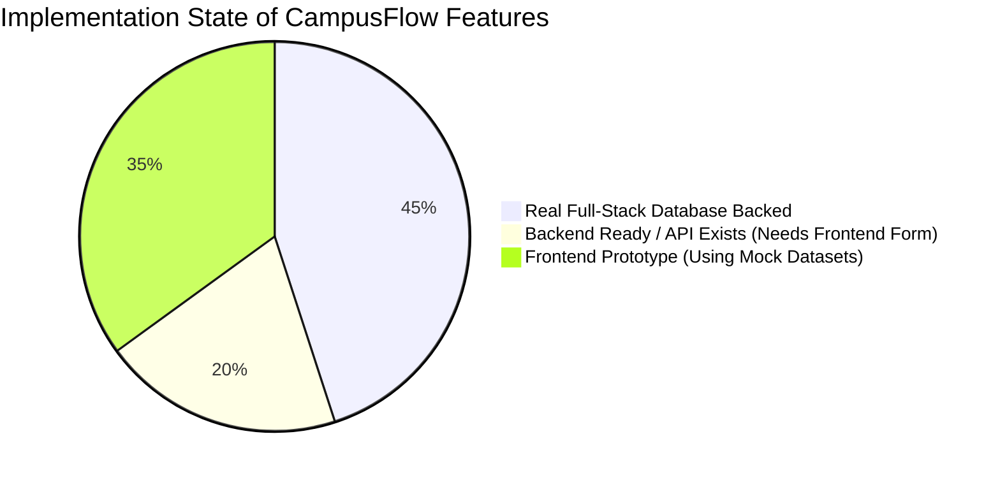
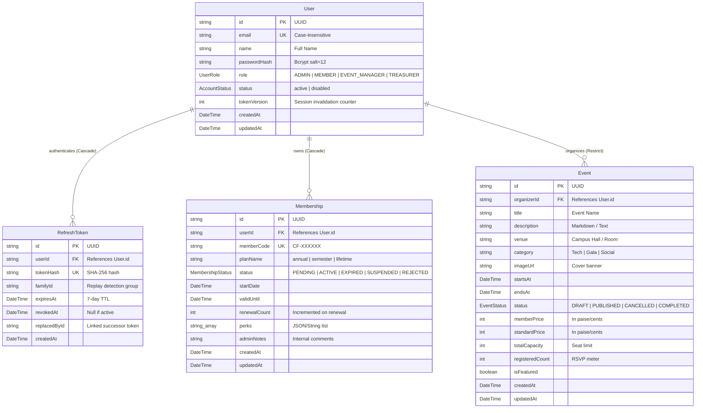

# CampusFlow — Complete Codebase Architecture & Implementation Guide

> **Audience**: B.Tech Computer Science Students, Academic Evaluators, and Technical Interviewers  
> **Repository**: [https://github.com/prtspndy/CampusFlow](https://github.com/prtspndy/CampusFlow)  
> **Status**: Verified against live source code (`D:\Projects\CampusFlow`)

---

## Table of Contents
1. [Project Overview & Core Mission](#1-project-overview--core-mission)
2. [Technology Stack & Architectural Rationale](#2-technology-stack--architectural-rationale)
3. [Full Directory Tree & File Inventory](#3-full-directory-tree--file-inventory)
4. [Implemented vs Incomplete / Prototype Features](#4-implemented-vs-incomplete--prototype-features)
5. [Backend Deep Dive: Core Files & Architecture](#5-backend-deep-dive-core-files--architecture)
6. [Frontend Deep Dive: Core Files & Architecture](#6-frontend-deep-dive-core-files--architecture)
7. [Database Architecture & Data Model (Prisma ORM)](#7-database-architecture--data-model-prisma-orm)
8. [Configuration & Environment Variables](#8-configuration--environment-variables)

---

## 1. Project Overview & Core Mission

### What CampusFlow Is
**CampusFlow** is an enterprise-grade web application designed as an **Operating System for Student Organizations**. Colleges and universities host dozens of student bodies (Computer Science Societies, Cultural Clubs, Robotics Teams, Sports Councils). Traditionally, these clubs rely on fragmented, insecure tools: Google Forms for registration, Excel spreadsheets for member tracking, WhatsApp groups for announcements, Google Drive for financial receipts, and manual paper ticketing for galas and hackathons.

CampusFlow centralizes these operations into a cohesive SaaS platform with:
- **Centralized Authentication & Token Management**: Secure user onboarding, encrypted credentials, single-flight token rotation, and active session revocation.
- **Canonical Four-Role RBAC**: Strict separation of duties between Admins, Event Managers, Treasurers, and Members.
- **Membership Pass Lifecycle**: Digital member passes, membership tiers, expiration tracking, and renewal counters.
- **Event Lifecycle & Digital Ticketing**: Draft workflows, capacity-constrained RSVPs, and door scanner validation.
- **Treasury Ledger & Financial Auditing**: Inflow/outflow tracking, member dues management, and volunteer expense reimbursements.

### Who Uses CampusFlow
1. **Club Members / Students (`MEMBER`)**: Sign up, view events, purchase tickets, manage digital membership passes, and order club merchandise.
2. **Event Managers & Volunteers (`EVENT_MANAGER`)**: Organize workshops, draft schedules, manage participant capacity, and scan QR tickets at the venue door.
3. **Treasurers (`TREASURER`)**: Maintain the general ledger, audit dues collection, review volunteer expense reimbursements, and produce financial reports.
4. **Club Presidents & Faculty Mentors (`ADMIN`)**: Assign organizational roles, manage settings, oversee member directories, approve financial disbursements, and control permissions.

---

## 2. Technology Stack & Architectural Rationale

CampusFlow uses a modern, strictly typed full-stack TypeScript architecture.

```mermaid
graph LR
    subgraph Client ["Frontend (Port 5173)"]
        React["React 19 + TypeScript"]
        Vite["Vite 8 Build Tool"]
        Tailwind["Tailwind CSS v4"]
        Zustand["Zustand (Auth Store)"]
    end

    subgraph Server ["Backend (Port 5000)"]
        Express["Express 4 + Node.js"]
        Zod["Zod Validation"]
        JWT["JWT + Refresh Rotation"]
        Prisma["Prisma ORM 6"]
    end

    subgraph Database ["Cloud Database"]
        Neon["PostgreSQL (Neon Serverless)"]
    end

    Client -->|"HTTP / REST API (JSON)"| Server
    Server -->|"Prisma Client (TCP/SSL)"| Database
```



| Component | Technology Chosen | Why It Was Chosen for This Project |
| :--- | :--- | :--- |
| **Frontend Framework** | React 19 + Vite 8 | Fast developer feedback loop with instant HMR (Hot Module Replacement), component-based architecture, and lightweight client bundling (538ms build). |
| **Language** | TypeScript (Strict Mode) | Full-stack type safety. Interfaces shared across models and API envelopes eliminate runtime shape mismatches (`null` vs `undefined`). |
| **Styling** | Tailwind CSS v4 + Design Tokens | Custom CSS variables in [variables.css](file:///D:/Projects/CampusFlow/frontend/src/styles/variables.css) establish a restrained, premium SaaS aesthetic (off-white canvas, charcoal typography, pastel domain tints) without bulky UI libraries. |
| **State Management** | Zustand | Lightweight (less than 2KB), boilerplate-free global store used for authentication session persistence and cache hydration without React Context re-render penalties. |
| **Backend Framework** | Node.js + Express 4 | Standard, mature HTTP middleware pipeline. Enables clean separation between authentication, authorization, validation, controllers, and services. |
| **Database & ORM** | PostgreSQL (Neon) + Prisma 6 | PostgreSQL provides ACID-compliant transactions (essential for ledger balances, token consumption, and ticket capacity). Prisma provides type-safe query generation and automated SQL schema migrations. |
| **Security & Auth** | JWT (`jsonwebtoken`) + `bcryptjs` | Stateless short-lived access tokens (15-minute TTL) paired with database-backed opaque refresh token families (7-day TTL) featuring single-use rotation and replay detection. |
| **Schema Validation** | Zod | Declarative schema validation ensuring incoming request payloads are strictly validated, sanitizing strings and emails before hitting business services. |
| **Testing** | Vitest + Supertest | Blazing fast in-memory execution. Full suite of 67 unit and integration tests executes in ~9 seconds using an in-memory Prisma mock. |

---

## 3. Full Directory Tree & File Inventory

```
D:\Projects\CampusFlow\
├── backend/                                   # Express REST API & Database Layer
│   ├── prisma/
│   │   ├── migrations/                        # Chronological SQL migration history
│   │   │   ├── 20261002120000_phase00_system_health_checks/
│   │   │   ├── 20261003120000_add_auth_users_and_refresh_tokens/
│   │   │   ├── 20261003130000_phase02_membership_and_events/
│   │   │   └── 20261003160000_canonical_four_role_rbac/
│   │   ├── schema.prisma                      # Prisma database schema definition
│   │   └── seed.ts                            # Idempotent database seeder for 4 canonical roles
│   ├── src/
│   │   ├── config/
│   │   │   └── env.ts                         # Zod-validated environment configuration
│   │   ├── docs/
│   │   │   ├── auth.openapi.ts                # OpenAPI spec for Auth and Admin APIs
│   │   │   ├── event.openapi.ts               # OpenAPI spec for Events API
│   │   │   ├── membership.openapi.ts          # OpenAPI spec for Membership API
│   │   │   └── swagger.ts                     # OpenAPI root specification builder
│   │   ├── lib/
│   │   │   └── prisma.ts                      # Singleton Prisma Client instance
│   │   ├── middleware/
│   │   │   ├── authenticate.middleware.ts     # JWT bearer authentication middleware
│   │   │   ├── authorize.middleware.ts        # Role and granular permission check middleware
│   │   │   ├── error.middleware.ts            # Centralized API error handler
│   │   │   ├── not-found.middleware.ts        # 404 handler for unmatched routes
│   │   │   ├── rate-limit.middleware.ts       # Express rate limiter for auth endpoints
│   │   │   └── validate.middleware.ts         # Generic Zod body, query, and params validator
│   │   ├── routes/
│   │   │   ├── admin.routes.ts                # /api/admin user listing and role updates
│   │   │   ├── auth.routes.ts                 # /api/auth registration, login, refresh, profile
│   │   │   ├── event.routes.ts                # /api/events lifecycle endpoints
│   │   │   ├── health.routes.ts               # /api/health liveness and readiness probes
│   │   │   ├── index.ts                       # Root API router mounting sub-routers
│   │   │   ├── membership.routes.ts           # /api/memberships lifecycle endpoints
│   │   │   └── users.routes.ts                # /api/users profile inspection endpoints
│   │   ├── services/
│   │   │   ├── auth.service.ts                # Authentication, sessions, user updates, and RBAC
│   │   │   ├── event.service.ts               # Event business logic, drafting, and capacity checks
│   │   │   ├── membership.service.ts          # Membership pass business logic and status machine
│   │   │   ├── password.service.ts            # Bcrypt hashing and dummy timing equalization
│   │   │   ├── token.service.ts               # JWT signing, claims verification, and crypto tokens
│   │   │   └── user.presenter.ts              # DTO serializer stripping sensitive user hashes
│   │   ├── types/
│   │   │   ├── auth.ts                        # Canonical role enums, display names, and permissions matrix
│   │   │   └── express.d.ts                   # Express Request augmentation for req.user and req.id
│   │   ├── utils/
│   │   │   ├── async-handler.ts               # Wrapper catching rejected promises in route handlers
│   │   │   ├── errors.ts                      # Custom HTTP error hierarchy (Unauthorized, Forbidden, etc.)
│   │   │   └── response.ts                    # Standardized API response formatters
│   │   ├── validators/
│   │   │   ├── auth.validators.ts             # Zod schemas for login, register, role assignment
│   │   │   ├── event.validators.ts            # Zod schemas for event creation, updates, and query filters
│   │   │   └── membership.validators.ts       # Zod schemas for membership application and renewal
│   │   ├── app.ts                             # Express application factory with Helmet, CORS, and docs
│   │   └── server.ts                          # Node.js HTTP server listener
│   └── tests/
│       ├── helpers/
│       │   └── memory-prisma.ts               # High-fidelity in-memory Prisma mock for testing
│       ├── auth.test.ts                       # Integration tests for auth, registration, and sessions
│       ├── events.test.ts                     # Integration tests for event management
│       ├── health.test.ts                     # Integration tests for health probes
│       ├── memberships.test.ts                # Integration tests for membership workflows
│       ├── rate-limit.test.ts                 # Tests verifying brute-force protections
│       └── rbac.test.ts                       # Integration tests for 4-role RBAC enforcement
│
├── frontend/                                  # React 19 Client Application
│   ├── src/
│   │   ├── components/
│   │   │   ├── badges/                        # Status and domain badges
│   │   │   ├── cards/                         # Stat tiles, event cards, module cards
│   │   │   ├── feedback/                      # Empty states, banners, alerts
│   │   │   ├── forms/                         # Search pills, filter chips, input wrappers
│   │   │   ├── layout/                        # AdminLayout, MemberLayout, PublicLayout, CheckinLayout
│   │   │   ├── navigation/
│   │   │   │   ├── AdminSidebar.tsx           # Role-filtered desktop administration sidebar
│   │   │   │   ├── RequireAuth.tsx            # Protected route guard checking roles and permissions
│   │   │   │   ├── RouteEffects.tsx           # Window title and scroll position resetter
│   │   │   │   └── TopBar.tsx                 # Universal header with avatar and signout actions
│   │   │   └── ui/                            # Reusable base elements (Button, Input, DropdownMenu)
│   │   ├── features/
│   │   │   ├── admin/pages/
│   │   │   │   └── UserManagementPage.tsx     # Admin-only console to view and reassign user roles
│   │   │   ├── announcements/pages/           # Bulletin feed and rich composer
│   │   │   ├── auth/pages/
│   │   │   │   └── LoginPage.tsx              # Sign-in form with server-authoritative role routing
│   │   │   ├── dashboard/pages/
│   │   │   │   ├── AdminDashboard.tsx         # Role-tailored dashboard (Admin, Event Manager, Treasurer)
│   │   │   │   └── MemberHome.tsx             # Student dashboard with pass status and quick RSVP
│   │   │   ├── events/pages/                  # Event directory and event details
│   │   │   ├── fundraisers/pages/             # Campaign goals and volunteer task boards
│   │   │   ├── members/pages/
│   │   │   │   ├── JoinPage.tsx               # Member registration and plan selection
│   │   │   │   ├── MemberListPage.tsx         # Member roster table with status filtering
│   │   │   │   └── MemberPassPage.tsx         # Digital QR member identification pass
│   │   │   ├── public/pages/                  # Landing page and 404 page
│   │   │   ├── shop/pages/                    # Merchandise catalog and inventory management
│   │   │   ├── tickets/pages/                 # Ticket wallet and QR door check-in scanner
│   │   │   └── treasury/pages/                # Financial ledger, reimbursement claims, cash flow
│   │   ├── lib/
│   │   │   ├── api.ts                         # Fetch client with auto-refresh and ApiError wrapping
│   │   │   ├── authApi.ts                     # Auth and Admin REST endpoints wrapper
│   │   │   ├── cn.ts                          # clsx + tailwind-merge helper
│   │   │   ├── constants.ts                   # Canonical roles, display names, and modules config
│   │   │   ├── format.ts                      # Currency and date formatting helpers
│   │   │   ├── mockData.ts                    # Prototype mock datasets for unlinked UI features
│   │   │   ├── permissions.ts                 # Client-side permission evaluator (hasPermission, can)
│   │   │   └── session.ts                     # LocalStorage / SessionStorage token persistence
│   │   ├── stores/
│   │   │   └── authStore.ts                   # Zustand store managing authenticated user session
│   │   ├── styles/                            # CSS variable tokens (colors, typography, layout)
│   │   ├── types/
│   │   │   ├── enums.ts                       # UI status and category string union types
│   │   │   └── models.ts                      # Client domain entities (User, ClubEvent, Membership)
│   │   ├── App.tsx                            # Root application with react-router-dom route tree
│   │   └── main.tsx                           # DOM root mounting App inside React StrictMode
│   ├── package.json                           # Frontend scripts and dependencies
│   └── vite.config.ts                         # Vite build and Tailwind configuration
│
├── docs/                                      # Technical Architecture & Assessment Documentation
│   ├── API_CONTRACT.md                        # Formal REST contract specifications
│   ├── CAMPUSFLOW_CODEBASE_GUIDE.md           # [This Document] Full codebase guide
│   ├── CAMPUSFLOW_ROLE_PERMISSIONS.md         # Four-role RBAC permissions reference
│   ├── CAMPUSFLOW_APPLICATION_FLOWS.md        # Step-by-step application execution traces
│   └── CAMPUSFLOW_VIVA_PREPARATION.md         # Presentation, Q&A, and viva prep
├── README.md                                  # Product vision and design principles
└── SECURITY.md                                # Vulnerability disclosure policy
```

---

## 4. Implemented vs Incomplete / Prototype Features

To speak accurately during project reviews and interviews, you must clearly distinguish between **real database-backed endpoints** and **frontend prototype views**.



### ✅ 1. Fully Implemented (Full-Stack Database Backed)
1. **Authentication & Session Lifecycle**:
   - User Registration (`POST /api/auth/register`) via [JoinPage.tsx](file:///D:/Projects/CampusFlow/frontend/src/features/members/pages/JoinPage.tsx).
   - Sign In (`POST /api/auth/login`) via [LoginPage.tsx](file:///D:/Projects/CampusFlow/frontend/src/features/auth/pages/LoginPage.tsx).
   - Single-Flight Refresh Token Rotation (`POST /api/auth/refresh`) in [api.ts](file:///D:/Projects/CampusFlow/frontend/src/lib/api.ts).
   - Session Termination (`POST /api/auth/logout`) with token revocation.
   - Profile Inspection (`GET /api/auth/me`).
2. **Canonical Four-Role RBAC**:
   - Full PostgreSQL Enum (`ADMIN`, `MEMBER`, `EVENT_MANAGER`, `TREASURER`).
   - Granular permissions matrix returned dynamically on user profile.
   - Server-side authorization middleware on all routes.
   - Client-side navigation filtering and route protection in [RequireAuth.tsx](file:///D:/Projects/CampusFlow/frontend/src/components/navigation/RequireAuth.tsx).
3. **User Management & Role Reassignment**:
   - User Directory listing (`GET /api/admin/users`).
   - Role Reassignment (`PATCH /api/admin/users/:userId/role`) with last active admin demotion protection and session invalidation.
   - Real interactive UI in [UserManagementPage.tsx](file:///D:/Projects/CampusFlow/frontend/src/features/admin/pages/UserManagementPage.tsx).
4. **Health & Observability**:
   - Liveness probe (`GET /api/health`).
   - Readiness probe executing active SQL query `SELECT 1` on Neon (`GET /api/health/ready`).
   - Interactive Swagger UI documentation (`GET /api/docs`).

### 🟡 2. Backend Fully Implemented, Frontend Partially Connected
1. **Events Management**:
   - **Backend**: Complete Prisma model and REST API (`GET /api/events`, `POST /api/events`, `GET /api/events/:id`, `PATCH /api/events/:id`, `POST /api/events/:id/publish`, `POST /api/events/:id/cancel`). Includes draft access control, capacity tracking, and validation.
   - **Frontend**: [EventListPage.tsx](file:///D:/Projects/CampusFlow/frontend/src/features/events/pages/EventListPage.tsx) and [EventDetailPage.tsx](file:///D:/Projects/CampusFlow/frontend/src/features/events/pages/EventDetailPage.tsx) currently read static data from [mockData.ts](file:///D:/Projects/CampusFlow/frontend/src/lib/mockData.ts). The backend routes are tested with 13 Vitest tests, but the frontend has not yet replaced `MOCK_EVENTS` with an `api.get('/events')` hook.
2. **Membership Passes**:
   - **Backend**: Complete Prisma model and REST API (`POST /api/memberships`, `POST /api/memberships/apply`, `GET /api/memberships/me`, `GET /api/memberships`, `GET /api/memberships/:id`, `POST /api/memberships/:id/renew`, `PATCH /api/memberships/:id/status`). Includes unique member code generation, renewal counts, and status state machine.
   - **Frontend**: [MemberListPage.tsx](file:///D:/Projects/CampusFlow/frontend/src/features/members/pages/MemberListPage.tsx) and [MemberPassPage.tsx](file:///D:/Projects/CampusFlow/frontend/src/features/members/pages/MemberPassPage.tsx) display static data from `MOCK_MEMBERS`.

### ⚪ 3. Prototype Views (Frontend UI Exists, Backend Not Built Yet)
These screens feature polished UI layouts adhering to [DESIGN.md](file:///D:/Projects/CampusFlow/DESIGN.md), but store state locally in memory:
- **Merchandise & Stock** (`/admin/shop`, `/shop`): Mock catalog of hoodies and tees. No `Product` or `Order` Prisma model in the backend schema yet.
- **Door Staff QR Scanner** (`/checkin/:eventId`): Interactive camera/simulator interface in [CheckinPage.tsx](file:///D:/Projects/CampusFlow/frontend/src/features/tickets/pages/CheckinPage.tsx). No `Ticket` Prisma model in the database yet.
- **Treasury Ledger & Reimbursements** (`/admin/treasury`): Detailed cash flow UI with charts and approval modals in [TreasuryDashboard.tsx](file:///D:/Projects/CampusFlow/frontend/src/features/treasury/pages/TreasuryDashboard.tsx). No `LedgerTransaction` or `Reimbursement` model in the backend schema yet.
- **Volunteer Tasks & Fundraisers** (`/admin/fundraisers`): Campaign progress bars and task Kanban board in [FundraiserPage.tsx](file:///D:/Projects/CampusFlow/frontend/src/features/fundraisers/pages/FundraiserPage.tsx).

---

## 5. Backend Deep Dive: Core Files & Architecture

### 1. [server.ts](file:///D:/Projects/CampusFlow/backend/src/server.ts) & [app.ts](file:///D:/Projects/CampusFlow/backend/src/app.ts)
- **Problem Solved**: Bootstraps the Node.js process, loads security middleware, configures CORS, mounts routers, and manages graceful shutdowns.
- **Key Logic**:
  - `createApp()` sets up `helmet()` (content security policy), strict `cors()` with origin validation, request correlation IDs (`req.id`), and `express.json({ limit: '100kb' })` to prevent memory denial-of-service.
  - Mounts Swagger UI at `/api/docs` and centralized routes at `/api`.
  - Captures unhandled errors and 404s.
- **Code Snippet**:
  ```typescript
  // Correlation ID assignment in app.ts
  app.use((req, res, next) => {
    const incomingId = req.headers['x-request-id'];
    const correlationId = typeof incomingId === 'string' && incomingId.trim().length > 0
      ? incomingId
      : crypto.randomUUID();
    req.id = correlationId;
    res.setHeader('X-Request-Id', correlationId);
    next();
  });
  ```
- **Security Consideration**: Setting body limits to `100kb` prevents attackers from exhausting server RAM with oversized JSON payloads.

### 2. [env.ts](file:///D:/Projects/CampusFlow/backend/src/config/env.ts)
- **Problem Solved**: Prevents the application from booting with missing, invalid, or insecure configuration.
- **Key Logic**: Uses Zod to parse `process.env`. If any variable is invalid (e.g. `PORT` not an integer, or `JWT_ACCESS_SECRET` shorter than 32 characters), it terminates the process with exit code 1 immediately on startup and prints human-readable errors without leaking secrets.

### 3. [token.service.ts](file:///D:/Projects/CampusFlow/backend/src/services/token.service.ts)
- **Problem Solved**: Manages JSON Web Tokens and high-entropy opaque refresh tokens.
- **Key Functions**:
  - `signAccessToken(userId, tokenVersion)`: Signs an HMAC-SHA256 JWT containing `sub` (user ID) and `tv` (token version). Lifetime: 15 minutes (`JWT_ACCESS_TTL_SECONDS = 900`).
  - `verifyAccessToken(token)`: Validates JWT signature, expiration, issuer (`campusflow`), and audience (`campusflow-api`).
  - `generateRefreshToken()`: Creates 32 random bytes from `crypto.randomBytes`, returns raw hex token and its SHA-256 hash. Only the hash is stored in the database.
- **Code Snippet**:
  ```typescript
  export function signAccessToken(userId: string, tokenVersion: number): string {
    const payload: AccessTokenClaims = {
      sub: userId,
      tv: tokenVersion,
      typ: 'access',
    };
    return jwt.sign(payload, env.JWT_ACCESS_SECRET, {
      expiresIn: env.JWT_ACCESS_TTL_SECONDS,
      issuer: env.JWT_ISSUER,
      audience: env.JWT_AUDIENCE,
    });
  }
  ```

### 4. [auth.service.ts](file:///D:/Projects/CampusFlow/backend/src/services/auth.service.ts)
- **Problem Solved**: Core identity and access business logic: registration, authentication, refresh token family rotation, logout, and role assignment.
- **Key Functions**:
  - `registerUser(input)`: Ensures email uniqueness, hashes password, defaults role to `MEMBER`, and returns a sanitized `PublicUser`.
  - `loginUser(input)`: Validates credentials. On success, generates a refresh token family (`familyId = randomUUID()`) and saves it to Neon.
  - `refreshSession(rawRefreshToken)`: Executes an atomic `$transaction` with concurrency guards. Detects token reuse (replay attacks). If a previously revoked token is reused, the entire token family is revoked immediately.
  - `updateUserRole(adminUserId, targetUserId, newRole)`: Validates target user. Prevents demoting the last active administrator. Increments `tokenVersion` to invalidate active access tokens. Revokes active refresh tokens.
- **Code Snippet**:
  ```typescript
  // Last active admin protection in auth.service.ts
  if (targetUser.role === 'ADMIN' && newRole !== 'ADMIN') {
    const activeAdminCount = await tx.user.count({
      where: { role: 'ADMIN', status: 'active' },
    });
    if (activeAdminCount <= 1) {
      throw new BadRequestError('Cannot demote or change the role of the last active administrator');
    }
  }
  ```

### 5. [authenticate.middleware.ts](file:///D:/Projects/CampusFlow/backend/src/middleware/authenticate.middleware.ts) & [authorize.middleware.ts](file:///D:/Projects/CampusFlow/backend/src/middleware/authorize.middleware.ts)
- **Problem Solved**: Intercepts requests, validates authorization headers, verifies token versions against database state, and checks permissions.
- **Key Logic**:
  - Extracts `Bearer <token>` from the `Authorization` header.
  - Verifies JWT claims.
  - Fetches the user from PostgreSQL. If `user.tokenVersion !== claims.tv`, the token has been revoked (e.g. by password reset or role change), so it rejects the request with HTTP 401 `TOKEN_REVOKED`.
  - Injects `req.user` into the Express request.
  - `requirePermission(perm)` evaluates whether `req.user.role` grants `perm` according to the permissions matrix.

---

## 6. Frontend Deep Dive: Core Files & Architecture

### 1. [App.tsx](file:///D:/Projects/CampusFlow/frontend/src/App.tsx)
- **Problem Solved**: Defines the complete client-side routing tree with code splitting (`lazy()`) and nested layout hierarchies.
- **Key Layouts**:
  1. `PublicLayout` (`/`, `/events`, `/shop`, `/join`, `/login`): Max width 1200px, public navigation bar.
  2. `MemberLayout` (`/member`, `/member/pass`, `/member/tickets`): Phone-first (max 640px), sticky bottom tab navigation.
  3. `AdminLayout` (`/admin`, `/admin/users`, `/admin/members`, `/admin/treasury`): Desktop sidebar (248px) + fluid 1280px content area. Protected by `RequireAuth roles={ADMIN_CONSOLE_ROLES}`.
  4. `CheckinLayout` (`/checkin/:eventId`): Full-screen high-contrast dark theme optimized for door scanners.

### 2. [api.ts](file:///D:/Projects/CampusFlow/frontend/src/lib/api.ts)
- **Problem Solved**: Robust HTTP client wrapping the browser's native `fetch` API.
- **Key Features**:
  - Automatically attaches `Authorization: Bearer <token>` when tokens exist in memory or local storage.
  - **Single-Flight Refresh Token Interceptor**: If the backend returns `401 TOKEN_EXPIRED`, `api.ts` suspends outgoing requests, calls `POST /api/auth/refresh`, updates the tokens, and retries the original request seamlessly.
  - Unwraps standard success responses `{ success: true, data: T }` and converts error responses `{ success: false, error: ... }` into thrown instances of `ApiError`.

### 3. [authStore.ts](file:///D:/Projects/CampusFlow/frontend/src/stores/authStore.ts)
- **Problem Solved**: Central reactive state store for user identity and authentication status.
- **Key State Variables**:
  - `user`: `User | null` (contains ID, name, email, canonical role, `roleDisplayName`, and `permissions`).
  - `status`: `'checking' | 'anonymous' | 'authenticated'`.
- **Key Actions**:
  - `hydrate()`: Calls `GET /api/auth/me` on initial page load to verify the stored session against the backend.
  - `login(email, password)`: Calls `authApi.login`, saves tokens, updates user state.
  - `logout()`: Calls `authApi.logout`, purges tokens from browser storage, resets user to `null`.

### 4. [UserManagementPage.tsx](file:///D:/Projects/CampusFlow/frontend/src/features/admin/pages/UserManagementPage.tsx)
- **Problem Solved**: Provides the club president (`ADMIN`) with an administrative console to inspect student accounts and reassign roles.
- **Key Features**:
  - Fetches users via `GET /api/admin/users`.
  - Filter chips to view counts by role (`ADMIN`, `EVENT_MANAGER`, `TREASURER`, `MEMBER`).
  - Live search filtering by student name or email.
  - Role dropdown selector triggering `PATCH /api/admin/users/:userId/role`.
  - Handles backend validation errors gracefully (e.g. alerts the admin if they attempt to demote the sole remaining administrator).

---

## 7. Database Architecture & Data Model (Prisma ORM)

### Database Entity Relationship Diagram (ERD)



### Explanation of Models
1. **`User`**: Core account identity. Contains `tokenVersion` (integer counter). When a user changes roles or signs out everywhere, `tokenVersion` is incremented, instantly invalidating all existing access tokens without needing an in-memory token blacklist like Redis.
2. **`RefreshToken`**: Manages secure session persistence. Tokens are stored only as SHA-256 hashes (`tokenHash`). Rotating a token marks the old token `revokedAt = now()` and creates a new one sharing the same `familyId`. If an attacker attempts to present an already revoked token, the server revokes the entire `familyId`, terminating all sessions for that device.
3. **`Membership`**: Tracks club pass subscriptions. Has a unique `memberCode` formatted as `CF-XXXXXX`. Status follows a strict state machine (`PENDING` -> `ACTIVE` -> `EXPIRED`).
4. **`Event`**: Stores club events and workshops. Tracks `totalCapacity` and `registeredCount`. Has a status state machine (`DRAFT` -> `PUBLISHED` -> `CANCELLED` / `COMPLETED`).

---

## 8. Configuration & Environment Variables

The project uses separate `.env` files for backend and frontend. **Never commit `.env` files containing production secrets to version control.**

### Backend Environment Variables (`backend/src/config/env.ts`)
- `PORT`: HTTP port Express listens on (default: `5000`).
- `NODE_ENV`: Application environment (`development`, `production`, `test`).
- `API_PREFIX`: Route prefix (default: `/api`).
- `FRONTEND_URL`: Allowed CORS origin(s) (e.g. `http://localhost:5173`).
- `DATABASE_URL`: Connection string for Neon PostgreSQL database.
- `DIRECT_URL`: Direct non-pooled connection string used by Prisma migrations.
- `JWT_ACCESS_SECRET`: 256-bit secret used to sign and verify HMAC-SHA256 access tokens (minimum 32 characters).
- `JWT_ACCESS_TTL_SECONDS`: Access token lifetime in seconds (default: `900` = 15 minutes).
- `JWT_REFRESH_TTL_DAYS`: Refresh token lifetime in days (default: `7`).
- `JWT_ISSUER`: JWT token issuer claim (default: `campusflow`).
- `JWT_AUDIENCE`: JWT token audience claim (default: `campusflow-api`).
- `BCRYPT_ROUNDS`: Cost factor for password hashing (default: `12` in dev/prod, `4` in tests for speed).
- `AUTH_RATE_LIMIT_MAX`: Maximum login/registration attempts per IP within the rate-limit window (default: `10`).
- `AUTH_RATE_LIMIT_WINDOW_MS`: Rate limiting window in milliseconds (default: `900000` = 15 minutes).

### Frontend Environment Variables
- `VITE_API_URL` / `VITE_API_BASE_URL`: Base URL of the backend API (defaults to `http://localhost:5000/api` if omitted).
