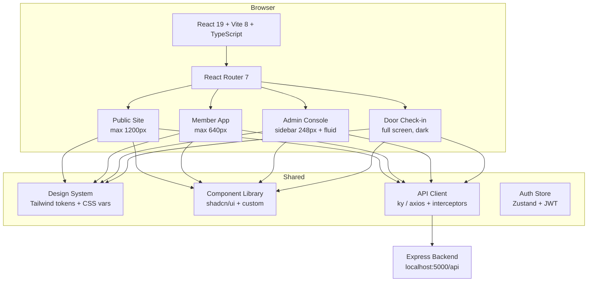
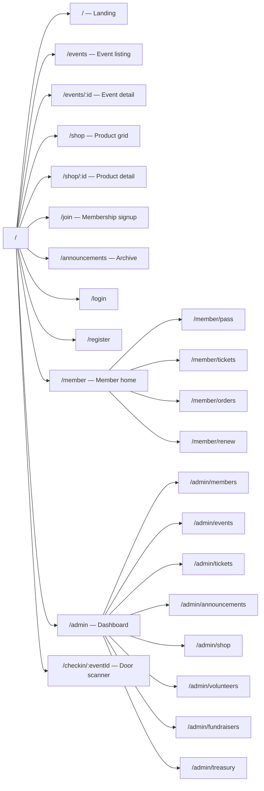

# CampusFlow — Complete Frontend Implementation Plan

> [!NOTE]
> This plan is derived from analysis of all project files: [DESIGN.md](file:///d:/GitHub%20Repository/Odoo-hackathon-2026/Project/CampusFlow/DESIGN.md), [Student_Organization_System_README.md](file:///d:/GitHub%20Repository/Odoo-hackathon-2026/Project/CampusFlow/Student_Organization_System_README.md), [package.json](file:///d:/GitHub%20Repository/Odoo-hackathon-2026/Project/CampusFlow/frontend/package.json), [App.tsx](file:///d:/GitHub%20Repository/Odoo-hackathon-2026/Project/CampusFlow/frontend/src/App.tsx), and all configuration files.

---

## 1. Current State Assessment

### What exists today

| Area | Status | Details |
|---|---|---|
| Vite + React + TypeScript | ✅ Scaffolded | React 19, Vite 8, TS 6 — all latest |
| Tailwind CSS | ❌ Not installed | README specifies it, but it's missing |
| shadcn/ui | ❌ Not installed | README specifies it, but it's missing |
| React Router | ❌ Not installed | No routing at all |
| App code | ❌ Default template | [App.tsx](file:///d:/GitHub%20Repository/Odoo-hackathon-2026/Project/CampusFlow/frontend/src/App.tsx) is the Vite starter |
| Design system | ✅ Comprehensive | [DESIGN.md](file:///d:/GitHub%20Repository/Odoo-hackathon-2026/Project/CampusFlow/DESIGN.md) — 1199 lines with full tokens, components, dark theme |
| API client | ❌ None | No Axios/fetch wrapper, no env vars |
| Forms / validation | ❌ None | React Hook Form + Zod specified but not installed |
| State management | ❌ None | Not yet decided |

### Key gap

The frontend is a **blank Vite template** that needs to become a complete multi-surface application (public site, member app, admin console, door check-in) governed by an exceptionally detailed 60KB design system.

---

## 2. Technology Stack (Confirmed)

| Layer | Library | Version / Notes |
|---|---|---|
| Build | Vite 8 | Already installed |
| UI Framework | React 19 | Already installed |
| Language | TypeScript 6 | Already installed |
| Styling | **Tailwind CSS 4** | To install — native CSS, no config file needed |
| Component library | **shadcn/ui** | To install — headless, customisable primitives |
| Routing | **React Router 7** | To install |
| Forms | **React Hook Form** | To install |
| Validation | **Zod** | To install |
| Charts | **Recharts** | To install |
| QR codes | **qrcode.react** | To install (display) |
| HTTP client | **ky** or **axios** | To install — lightweight fetch wrapper |
| State | **Zustand** or React Context | Recommend Zustand for auth/cart/theme |
| Icons | **Lucide React** | Matches DESIGN.md spec (24px, 1.75px stroke) |
| Fonts | Plus Jakarta Sans, Inter, JetBrains Mono | Google Fonts — load in index.html |
| Date formatting | **date-fns** | For relative/absolute date display per DESIGN.md |

---

## 3. Architecture Overview



---

## 4. Folder Structure

```text
frontend/
├── public/
│   ├── favicon.svg
│   └── icons.svg
├── src/
│   ├── main.tsx                          # Entry point
│   ├── App.tsx                           # Router + providers
│   │
│   ├── design-system/                    # 🎨 Design tokens
│   │   ├── tokens.css                    # CSS custom properties from DESIGN.md
│   │   ├── typography.css                # Font-face + type scale utilities
│   │   └── tailwind.css                  # @import "tailwindcss" + theme config
│   │
│   ├── components/                       # 🧱 Reusable UI
│   │   ├── ui/                           # shadcn/ui primitives (Button, Input, Dialog…)
│   │   ├── layout/
│   │   │   ├── PublicLayout.tsx           # 1200px container, alt-band rhythm
│   │   │   ├── MemberLayout.tsx           # 640px max, bottom tab bar
│   │   │   ├── AdminLayout.tsx            # Sidebar + content shell
│   │   │   └── CheckinLayout.tsx          # Fullscreen dark
│   │   ├── navigation/
│   │   │   ├── BottomTabBar.tsx           # 5-item mobile nav
│   │   │   ├── AdminSidebar.tsx           # 248px sidebar with module icons
│   │   │   ├── TopBar.tsx                 # Search pill + profile menu
│   │   │   └── MobileDrawer.tsx           # Tablet collapsible drawer
│   │   ├── cards/
│   │   │   ├── BaseCard.tsx               # card-base
│   │   │   ├── ModuleCard.tsx             # card-module-* with tint prop
│   │   │   ├── EventCard.tsx              # Photo + date block + price + seat meter
│   │   │   ├── ProductCard.tsx            # Photo + price + member badge
│   │   │   └── StatTile.tsx              # stat-tile with money token
│   │   ├── data-display/
│   │   │   ├── LedgerRow.tsx              # ledger-row
│   │   │   ├── TaskRow.tsx                # task-row with checkbox
│   │   │   ├── DataTable.tsx              # Sortable, sticky header, responsive
│   │   │   ├── SeatMeter.tsx              # Progress bar with warning state
│   │   │   └── CategoryBar.tsx            # Horizontal stacked bar chart
│   │   ├── badges/
│   │   │   ├── StatusBadge.tsx            # active / expiring / expired / neutral
│   │   │   └── MemberPriceBadge.tsx       # badge-member-price
│   │   ├── feedback/
│   │   │   ├── Toast.tsx                  # Bottom toast with undo
│   │   │   ├── Banner.tsx                 # banner-info / banner-warning
│   │   │   ├── EmptyState.tsx             # Illustration + message + CTA
│   │   │   ├── LoadingSkeleton.tsx         # Shimmer cards/rows
│   │   │   └── ErrorState.tsx             # Error + retry
│   │   ├── tickets/
│   │   │   ├── MemberPass.tsx             # Navy pass with QR + sunset bar
│   │   │   ├── TicketStub.tsx             # Perforated stub with notches
│   │   │   └── QRTile.tsx                 # QR code on white tile
│   │   ├── forms/
│   │   │   ├── FormField.tsx              # Label + input + error (RHF integrated)
│   │   │   ├── SearchPill.tsx             # search-pill
│   │   │   ├── FilterChips.tsx            # chip-filter / chip-filter-active
│   │   │   ├── SizePicker.tsx             # Apparel size chips
│   │   │   └── DatePicker.tsx             # Date input
│   │   └── theme/
│   │       └── ThemeProvider.tsx           # Light/dark/system toggle via Zustand
│   │
│   ├── features/                         # 📦 Feature modules
│   │   ├── auth/
│   │   │   ├── pages/
│   │   │   │   ├── LoginPage.tsx
│   │   │   │   ├── RegisterPage.tsx
│   │   │   │   └── ForgotPasswordPage.tsx
│   │   │   ├── components/
│   │   │   │   └── ProtectedRoute.tsx
│   │   │   └── hooks/
│   │   │       └── useAuth.ts
│   │   │
│   │   ├── dashboard/
│   │   │   └── pages/
│   │   │       ├── AdminDashboard.tsx     # Module hub with stat tiles
│   │   │       └── MemberHome.tsx         # Pass + upcoming events
│   │   │
│   │   ├── members/                      # 🔵 Sky tint
│   │   │   ├── pages/
│   │   │   │   ├── MemberListPage.tsx     # Admin: table + filters
│   │   │   │   ├── MemberDetailPage.tsx   # Admin: profile + history
│   │   │   │   ├── JoinPage.tsx           # Public: membership signup
│   │   │   │   ├── MemberPassPage.tsx     # Member: digital pass
│   │   │   │   └── RenewalPage.tsx        # Member: renewal flow
│   │   │   └── components/
│   │   │       ├── MemberTable.tsx
│   │   │       └── RenewalBanner.tsx
│   │   │
│   │   ├── events/                       # 🟠 Peach tint
│   │   │   ├── pages/
│   │   │   │   ├── EventListPage.tsx      # Public/member: browsable grid
│   │   │   │   ├── EventDetailPage.tsx    # Photo header, pricing, seat meter
│   │   │   │   ├── EventCreatePage.tsx    # Admin: create/edit form
│   │   │   │   └── EventManagePage.tsx    # Admin: registrations + stats
│   │   │   └── components/
│   │   │       ├── DateBlock.tsx
│   │   │       ├── PriceRow.tsx
│   │   │       └── EventForm.tsx
│   │   │
│   │   ├── tickets/                      # 🟠 Peach tint (shared with events)
│   │   │   ├── pages/
│   │   │   │   ├── TicketCheckoutPage.tsx  # Purchase flow
│   │   │   │   ├── MyTicketsPage.tsx       # Member: ticket wallet
│   │   │   │   └── CheckinPage.tsx        # Door: fullscreen scanner
│   │   │   └── components/
│   │   │       ├── TicketPicker.tsx
│   │   │       ├── CheckinResult.tsx      # Valid / used / invalid states
│   │   │       └── AttendanceCounter.tsx
│   │   │
│   │   ├── announcements/                # 🟣 Lavender tint
│   │   │   ├── pages/
│   │   │   │   ├── AnnouncementFeed.tsx   # Feed with lavender headers
│   │   │   │   └── AnnouncementComposer.tsx # Admin: rich-text compose
│   │   │   └── components/
│   │   │       └── AnnouncementCard.tsx
│   │   │
│   │   ├── shop/                         # 🟢 Mint tint
│   │   │   ├── pages/
│   │   │   │   ├── ShopPage.tsx           # Product grid (2-up / 4-up)
│   │   │   │   ├── ProductPage.tsx        # Detail + size picker + cart
│   │   │   │   ├── CartPage.tsx           # Bottom sheet / drawer
│   │   │   │   ├── ShopCheckoutPage.tsx   # Single-page checkout
│   │   │   │   └── AdminStockPage.tsx     # Stock management table
│   │   │   └── components/
│   │   │       ├── SizeChips.tsx
│   │   │       └── CartSheet.tsx
│   │   │
│   │   ├── volunteers/                   # 🟡 Butter tint (shared with tasks)
│   │   │   ├── pages/
│   │   │   │   ├── VolunteerListPage.tsx
│   │   │   │   └── VolunteerSignupPage.tsx
│   │   │   └── components/
│   │   │       └── VolunteerCard.tsx
│   │   │
│   │   ├── fundraisers/                  # 🟡 Butter tint
│   │   │   ├── pages/
│   │   │   │   ├── FundraiserPage.tsx     # Progress card + tasks
│   │   │   │   └── TaskBoardPage.tsx      # List / board view toggle
│   │   │   └── components/
│   │   │       ├── ProgressCard.tsx
│   │   │       └── TaskBoard.tsx
│   │   │
│   │   └── treasury/                     # 🟢 Sage tint
│   │       ├── pages/
│   │       │   ├── TreasuryDashboard.tsx   # 3 stat tiles + category bar
│   │       │   ├── LedgerPage.tsx         # Full ledger with filters
│   │       │   └── ReimbursementPage.tsx   # Submit + review flow
│   │       └── components/
│   │           ├── MoneyStatTiles.tsx
│   │           ├── Ledger.tsx
│   │           └── ReceiptModal.tsx
│   │
│   ├── lib/                              # 🔧 Utilities
│   │   ├── api.ts                        # HTTP client setup (base URL from env)
│   │   ├── auth.ts                       # Token storage, refresh, interceptors
│   │   ├── format.ts                     # Money formatting (Intl.NumberFormat)
│   │   ├── dates.ts                      # Relative/absolute date helpers
│   │   ├── cn.ts                         # clsx + tailwind-merge utility
│   │   └── constants.ts                  # Module tint mappings, breakpoints
│   │
│   ├── stores/                           # 🗃️ Global state (Zustand)
│   │   ├── authStore.ts                  # User, role, token
│   │   ├── themeStore.ts                 # System / light / dark
│   │   └── cartStore.ts                  # Shop cart
│   │
│   ├── hooks/                            # 🪝 Shared hooks
│   │   ├── useMediaQuery.ts              # Breakpoint detection
│   │   ├── useTheme.ts                   # Current theme
│   │   └── useScreenBrightness.ts        # For member pass screen brighten
│   │
│   └── types/                            # 📋 Shared TypeScript types
│       ├── api.ts                        # API response shapes
│       ├── models.ts                     # User, Event, Ticket, Product, etc.
│       └── enums.ts                      # Roles, statuses, ticket states
│
├── index.html
├── tailwind.css                          # or inside src/
├── vite.config.ts
├── tsconfig.json
├── tsconfig.app.json
├── tsconfig.node.json
├── package.json
└── .env.local                            # VITE_API_URL only
```

---

## 5. Design System Implementation

### 5.1 CSS Custom Properties ([tokens.css](file:///d:/GitHub%20Repository/Odoo-hackathon-2026/Project/CampusFlow/DESIGN.md#L6-L101))

All 100+ color tokens from DESIGN.md get mapped to CSS custom properties on `:root` (light) and `[data-theme="dark"]` (dark). This is the **single source of truth** — Tailwind references these vars.

```css
/* Excerpt — full file will contain all tokens */
:root {
  --color-primary: #2457f5;
  --color-primary-pressed: #1b44cc;
  --color-primary-deep: #14339a;
  --color-primary-tint: #e8eeff;
  --color-on-primary: #ffffff;
  --color-brand-navy: #0b1437;
  --color-canvas: #ffffff;
  --color-surface: #f6f7fb;
  --color-ink: #0f1630;
  --color-body: #3a4260;
  --color-muted: #5f6788;
  /* ... all tints, semantics, money, checkin */
  --elevation-1: 0 1px 2px rgba(15,22,48,0.06);
  --elevation-2: 0 4px 16px rgba(15,22,48,0.08);
  --elevation-3: 0 24px 48px -12px rgba(15,22,48,0.22);
  --elevation-focus: 0 0 0 3px rgba(36,87,245,0.35);
  --motion-fast: 120ms;
  --motion-base: 200ms;
  --motion-slow: 320ms;
  --motion-easing: cubic-bezier(0.2, 0, 0, 1);
}

[data-theme="dark"] {
  --color-primary: #7c9bff;
  --color-canvas: #0b1020;
  --color-surface: #121936;
  --color-ink: #f2f4ff;
  /* ... all dark overrides */
}
```

### 5.2 Typography ([typography.css](file:///d:/GitHub%20Repository/Odoo-hackathon-2026/Project/CampusFlow/DESIGN.md#L207-L336))

```css
@import url('https://fonts.googleapis.com/css2?family=Plus+Jakarta+Sans:wght@700;800&family=Inter:wght@400;500;600;700&family=JetBrains+Mono:wght@500;600&display=swap');

/* Tailwind utilities like .text-display-xl, .text-heading-1, .text-money-lg */
```

### 5.3 Tailwind 4 Theme Extension

Tailwind 4 uses CSS-based configuration. The theme maps to the CSS variables:

```css
@import "tailwindcss";

@theme {
  --color-primary: var(--color-primary);
  --color-primary-pressed: var(--color-primary-pressed);
  --color-canvas: var(--color-canvas);
  --color-surface: var(--color-surface);
  --color-ink: var(--color-ink);
  --color-body: var(--color-body);
  /* ... */
  --radius-xs: 4px;
  --radius-sm: 6px;
  --radius-md: 10px;   /* buttons, inputs */
  --radius-lg: 14px;   /* cards */
  --radius-xl: 20px;   /* ticket, pass, modal */
  --radius-full: 9999px;
  /* spacing */
  --spacing-xxs: 4px;
  --spacing-xs: 8px;
  --spacing-sm: 12px;
  --spacing-md: 16px;
  --spacing-lg: 20px;
  --spacing-xl: 24px;
  --spacing-xxl: 32px;
  --spacing-section: 64px;
}
```

---

## 6. Routing Plan



### Route configuration

| Route Pattern | Layout | Auth | Role |
|---|---|---|---|
| `/`, `/events`, `/events/:id`, `/shop`, `/shop/:id`, `/join`, `/announcements` | PublicLayout | None | Any |
| `/login`, `/register` | Minimal | None | Any |
| `/member`, `/member/*` | MemberLayout | Required | Member+ |
| `/admin`, `/admin/*` | AdminLayout | Required | Volunteer / Treasurer / Admin |
| `/checkin/:eventId` | CheckinLayout | Required | Door staff / Admin |

---

## 7. Component Specifications

### 7.1 Signature Components

#### Member Pass
- Navy background (`--color-brand-navy`), 20px radius, Level 3 shadow
- 6px sunset (`#ff6b4a`) bar at top edge
- Club mark top-left, status badge top-right
- Name in `heading-2`, member ID in `code` font, QR on white 12px-padded tile
- Footer: validity date + perk chips
- States: Active, Expiring (adds warning banner + Renew button), Expired (grey QR overlay)
- Brightens screen on open

#### Ticket Stub
- 20px radius, Level 2 shadow, dashed perforation with semicircular notches
- **Mobile (< 640px)**: vertical — event info top, QR bottom, horizontal perforation
- **Desktop (≥ 640px)**: horizontal — info left, QR right, vertical perforation
- Contains: event name, date, venue, ticket type, holder, QR tile, ticket code
- Wallet buttons: "Add to Apple Wallet", "Add to Google Wallet"

#### Door Check-in
- Always dark theme, full screen
- Camera view with manual code entry field below
- Counter pinned at top: "142 of 180 in"
- Three result states (full screen, 1.5s then auto-resume):
  - ✅ Valid — green bg, "Welcome in, {Name}", haptic
  - ⚠️ Already used — amber bg, "Scanned at {time}", "Let in anyway" button
  - ❌ Invalid — red bg, "Ticket not found", manual lookup action
- 56px minimum buttons, no animation beyond fade

### 7.2 Common Components

| Component | Tokens Used | Key Behaviour |
|---|---|---|
| `Button` | `button-primary`, `-secondary`, `-ghost`, `-danger`, `-on-dark` | 44px min height, 10px radius, one primary per screen, full-width on mobile for main CTAs |
| `Input` | `input-text`, `-focused`, `-error` | 48px tall, 16px text (no mobile zoom), label above, validate on blur |
| `SearchPill` | `search-pill` | 48px, pill shape, surface bg, 18px search icon |
| `FilterChips` | `chip-filter`, `chip-filter-active` | 36px visual / 44px touch, ink fill when active |
| `StatusBadge` | `badge-active/expiring/expired/neutral` | Pill, always a word, optional 12px leading icon |
| `StatTile` | `stat-tile` | Surface bg, 14px radius, money token value, micro-uppercase label |
| `Toast` | `toast` | Navy bg, bottom-center mobile / bottom-left desktop, 4s + undo |
| `Banner` | `banner-info`, `banner-warning` | Inline at page top, dismissible |
| `Modal` | `modal` | 20px radius, Level 3, trap focus, bottom sheet on mobile |
| `EmptyState` | — | Illustration + 1 sentence + 1 primary CTA |

---

## 8. Phased Implementation Roadmap

### Phase 0 — Foundation & Architecture (Week 1)
> **Gate**: App runs, builds, type-checks; all devs can follow setup.

| Task | Owner | Files |
|---|---|---|
| Install Tailwind CSS 4, PostCSS | FE1 | `package.json`, `tailwind.css` |
| Install & configure shadcn/ui | FE1 | `components/ui/*` |
| Install React Router 7, set up routes | FE1 | `App.tsx`, feature `pages/` |
| Install Zustand, React Hook Form, Zod | FE1 | `package.json` |
| Install Lucide React, Recharts, qrcode.react | FE1 | `package.json` |
| Create `tokens.css` — all colors, spacing, elevation, motion | FE1 | `design-system/tokens.css` |
| Create `typography.css` — font imports + type scale | FE1 | `design-system/typography.css` |
| Tailwind theme config (CSS-based for v4) | FE1 | `design-system/tailwind.css` |
| Build layout shells: Public, Member, Admin, Checkin | FE1 | `components/layout/*` |
| Build navigation: BottomTabBar, AdminSidebar, TopBar | FE1 | `components/navigation/*` |
| Set up API client with `VITE_API_URL` | FE1 | `lib/api.ts`, `.env.local` |
| Create `cn()` utility (clsx + tw-merge) | FE1 | `lib/cn.ts` |
| Configure path aliases (`@/`) in Vite + TS | FE1 | `vite.config.ts`, `tsconfig.app.json` |
| Define TypeScript models and enums | FE1 | `types/*` |
| ThemeProvider (system/light/dark + localStorage) | FE1 | `components/theme/*`, `stores/themeStore.ts` |
| `.env.example` with `VITE_API_URL` | FE1 | `.env.example` |

### Phase 1 — Auth & App Shell (Week 2)
> **Gate**: Login/register works; protected routes redirect; roles enforced.

| Task | Owner |
|---|---|
| Auth store (Zustand) — token, user, role | FE1 |
| Login page | FE1 |
| Register page | FE1 |
| ProtectedRoute component (role-gated) | FE1 |
| Profile menu in TopBar (logout, theme toggle) | FE1 |
| Responsive nav behaviour (sidebar ↔ drawer ↔ bottom tabs) | FE1 |
| Loading, error, empty state primitives | FE1 |

### Phase 2 — Membership & Events (Weeks 3-4)
> **Gate**: Users can join, renew, browse/create events.

| Task | Owner |
|---|---|
| **Members Module** | |
| Public join page with dues checkout flow | FE2 |
| Member Pass page (navy card, QR, status, sunset bar) | FE2 |
| Renewal page + RenewalBanner (30-day / 7-day) | FE2 |
| Admin member list with table, search, status filters | FE2 |
| Admin member detail (profile + history) | FE2 |
| **Events Module** | |
| Public event listing (grid: 2-up mobile, 3-up desktop) | FE2 |
| Event detail page (photo header, date block, price row, seat meter) | FE2 |
| Admin event create/edit form | FE2 |
| Admin event manage page (registrations, stats) | FE2 |
| EventCard component (photo + date block + member/standard price) | FE2 |
| SeatMeter component (primary fill, warning at ≤10%, "Only X left") | FE2 |
| DateBlock component (month micro-uppercase, day heading-2) | FE2 |

### Phase 3 — Tickets, Payments & Check-in (Weeks 5-6)
> **Gate**: Ticket purchase works in Razorpay sandbox; check-in validates.

| Task | Owner |
|---|---|
| Ticket picker (member vs non-member pricing) | FE2 |
| Ticket checkout page (Razorpay integration on client) | FE2 |
| Post-purchase ticket stub with QR + wallet buttons | FE2 |
| My Tickets page (ticket wallet) | FE2 |
| Door Check-in page (camera, manual entry, counter) | FE2 |
| CheckinResult component (3 states, 1.5s auto-dismiss) | FE2 |
| QRTile component (always black-on-white) | FE2 |

### Phase 4 — Merchandise & Announcements (Weeks 7-8)
> **Gate**: Shop browsable, orders place; announcements publish.

| Task | Owner |
|---|---|
| **Shop Module** | |
| Product grid page (2-up / 4-up responsive) | FE2 |
| Product detail page with size picker | FE2 |
| SizeChips component (out-of-stock strikethrough, "3 left" badge) | FE2 |
| Cart (bottom sheet mobile / right drawer desktop) | FE2 |
| Shop checkout page (single Pay button with total) | FE2 |
| Admin stock management table (inline editable quantities) | FE2 |
| **Announcements Module** | |
| Announcement composer (title, rich text, audience chips, channels) | FE2 |
| Announcement feed (lavender headers, sent/opened stats) | FE2 |
| Public announcement archive | FE2 |

### Phase 5 — Volunteers, Fundraisers & Finance (Weeks 9-10)
> **Gate**: All CRUD flows complete; finance totals reconcile.

| Task | Owner |
|---|---|
| Volunteer opportunities list + signup | FE2 |
| Fundraiser page with progress card | FE2 |
| Task list + board view (list ↔ kanban toggle) | FE2 |
| TaskRow component (avatar, due date, checkbox) | FE2 |
| Treasury dashboard (3 stat tiles, category stacked bar) | FE2 |
| Ledger page (sortable, filterable, sticky header) | FE2 |
| Reimbursement flow (upload receipt, status tracking) | FE2 |
| Receipt modal | FE2 |
| Export button (CSV / PDF) | FE2 |

### Phase 6 — Integration, Testing & Polish (Week 11)
> **Gate**: All critical user journeys pass end-to-end.

| Task | Owner |
|---|---|
| Connect all pages to real API endpoints | FE1 + FE2 |
| End-to-end user journey testing | FE1 + FE2 |
| Responsive testing at 390px, 640px, 1024px, 1440px | FE1 |
| Accessibility audit (focus order, ARIA, contrast, targets) | FE1 |
| Dark theme QA across all screens | FE1 |
| Remove mock data, debug code, unused imports | FE1 + FE2 |
| Performance: code splitting, lazy loading routes | FE1 |
| `prefers-reduced-motion` support | FE1 |

### Phase 7 — Deployment (Week 12)
> **Gate**: Deployed on Vercel, all workflows tested in production.

| Task | Owner |
|---|---|
| Vercel deployment configuration | FE1 |
| Production environment variables | FE1 |
| SPA fallback routing for Vercel | FE1 |
| Lighthouse performance audit | FE1 |
| Demo accounts and data setup | FE1 + FE2 |

---

## 9. Design System Rules (from DESIGN.md — Non-Negotiable)

> [!IMPORTANT]
> These rules are extracted from the DESIGN.md and must be followed in every component.

### Color Rules
1. **One primary button per screen.** Everything else is secondary or ghost.
2. **Skyline Blue is never a card background** and never body text.
3. **Blue ≠ success, green ≠ action.** They stay semantically separate (per Wise).
4. **Red is only for**: overdrawn balance, failed payment, invalid ticket. Never ordinary expenses.
5. **Module tints are identity, not status.** Never mix one module's tint with another.
6. **Status is never colour alone.** Always pair with a word + icon.

### Typography Rules
1. All money values use `font-feature-settings: "tnum" 1` (tabular figures).
2. Right-align amounts in tables. Two decimals in ledgers.
3. Use `Intl.NumberFormat` — never hardcode currency symbols.
4. Inputs are always 16px to prevent iOS zoom.
5. No text below 13px except the 11px `micro-uppercase`.

### Shape Rules
1. **Buttons are 10px radius, never pills.** Pills = filters, status, search only.
2. Cards are 14px. Ticket/pass/modal are 20px.

### Layout Rules
1. **Phone first.** Design at 390px, then scale up.
2. **44px minimum touch targets** (56px for door check-in).
3. Tables become stacked cards on mobile — never horizontal scroll for key data.
4. Modals become bottom sheets on mobile.

### Theme Rules
1. Components reference **semantic tokens only** — never raw hex values.
2. Theme swap is instant, no animation.
3. Door Check-in is always dark regardless of user preference.
4. QR codes always stay black-on-white for scanning.
5. Never use pure black (`#000`) or pure white (`#fff`) in dark theme.

---

## 10. Immediate Next Steps

> [!TIP]
> The very first step is to install dependencies and wire up the design system. Everything else depends on it.

### Step 1: Install all dependencies
```bash
cd frontend
npm install tailwindcss @tailwindcss/vite react-router-dom zustand react-hook-form zod @hookform/resolvers recharts qrcode.react lucide-react date-fns clsx tailwind-merge
```

### Step 2: Configure Tailwind 4 with Vite plugin
Update `vite.config.ts` to add `@tailwindcss/vite` plugin.

### Step 3: Create the design token files
Translate DESIGN.md frontmatter into `tokens.css` with all CSS custom properties.

### Step 4: Build the four layout shells
PublicLayout, MemberLayout, AdminLayout, CheckinLayout.

### Step 5: Set up routing
React Router with the route table above and placeholder pages.

---

## 11. Key Decisions Still Needed

| Decision | Options | Impact |
|---|---|---|
| **Auth approach** | JWT (manual) vs Better Auth | Blocks Phase 1 — team must agree first |
| **State management** | Zustand (recommended) vs React Context | Auth, cart, theme stores |
| **HTTP client** | ky (lightweight) vs axios (more features) | API layer abstraction |
| **Rich text editor** | TipTap vs Slate vs Draft.js | Announcement composer |
| **QR scanner library** | html5-qrcode vs zxing-js | Door check-in camera |
| **Wallet integration** | Apple/Google Wallet API details | Ticket stub "Add to Wallet" |
