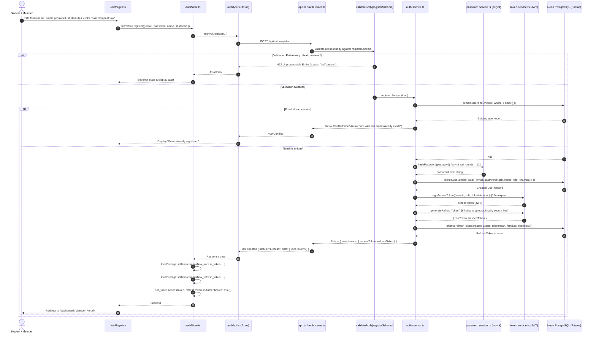
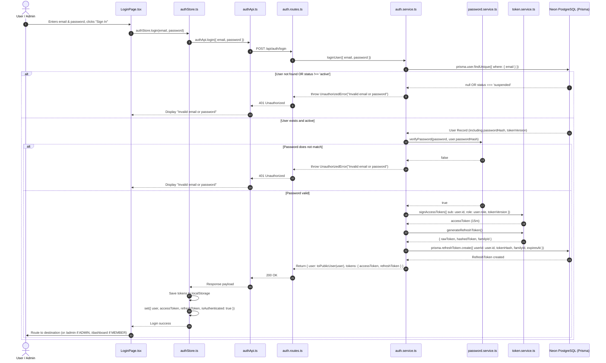
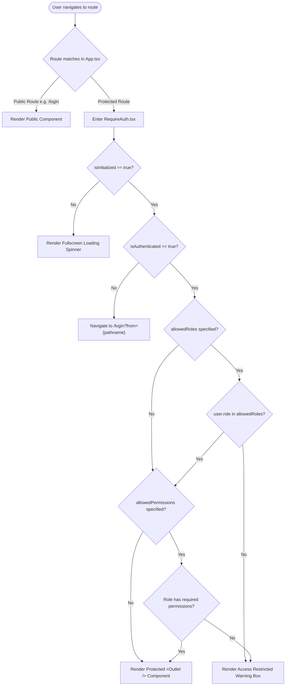
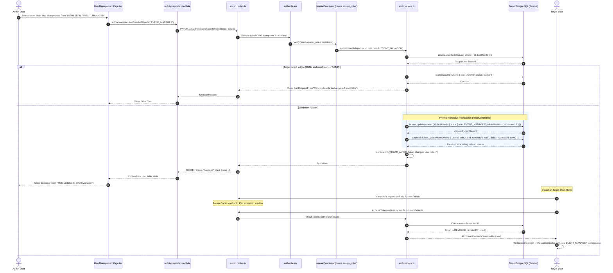
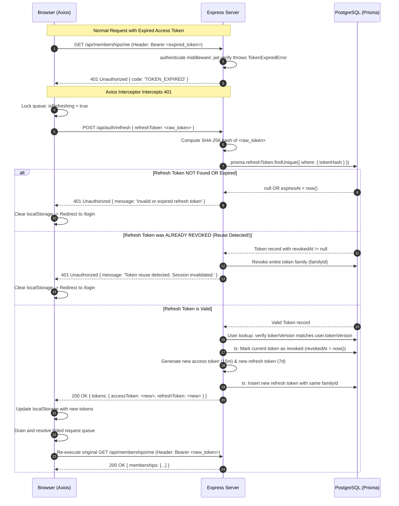

# CampusFlow — End-to-End Application Flows & Architecture Trace

This document provides a comprehensive, code-verified walkthrough of every major technical workflow in **CampusFlow**. Every sequence, function name, database operation, and file path reflects the exact implementation in the repository.

---

## Table of Contents
1. [System Topology & High-Level Architecture](#1-system-topology--high-level-architecture)
2. [Flow A: Application Startup & Database Connection](#2-flow-a-application-startup--database-connection)
3. [Flow B: User Registration Flow](#3-flow-b-user-registration-flow)
4. [Flow C: User Login Flow](#4-flow-c-user-login-flow)
5. [Flow D: Session Restoration & Refresh Token Rotation Flow](#5-flow-d-session-restoration--refresh-token-rotation-flow)
6. [Flow E: Frontend Protected Route Access & Authorization Flow](#6-flow-e-frontend-protected-route-access--authorization-flow)
7. [Flow F: Protected Backend API Request Pipeline](#7-flow-f-protected-backend-api-request-pipeline)
8. [Flow G: Administrative Role Reassignment Flow](#8-flow-g-administrative-role-reassignment-flow)
9. [Flow H: Feature Flows — Backend Realities vs Frontend Prototype State](#9-flow-h-feature-flows--backend-realities-vs-frontend-prototype-state)
10. [System Architecture Diagrams](#10-system-architecture-diagrams)
11. [Safe Testing, Inspection & Debugging Guide](#11-safe-testing-inspection--debugging-guide)

---

## 1. System Topology & High-Level Architecture

CampusFlow follows a decoupled client-server architecture:

```
+-----------------------------------------------------------------------------------------+
|                                    CLIENT BROWSER                                       |
|                                                                                         |
|  +-----------------------------------------------------------------------------------+  |
|  | React 19 + TypeScript + Vite SPA                                                  |  |
|  | - UI: Tailwind CSS + Lucide Icons                                                 |  |
|  | - State: Zustand (`authStore.ts`, `cartStore.ts`)                                |  |
|  | - Routing: React Router v7 (`App.tsx` -> Nested Layouts -> `<RequireAuth />`)     |  |
|  | - HTTP Client: Axios Instance with Single-Flight Refresh Interceptor              |  |
|  +-----------------------------------------------------------------------------------+  |
+--------------------------------------------+--------------------------------------------+
                                             | HTTP / JSON (REST API)
                                             | Base URL: http://localhost:5000/api
                                             v
+-----------------------------------------------------------------------------------------+
|                                    BACKEND SERVER                                       |
|                                                                                         |
|  +-----------------------------------------------------------------------------------+  |
|  | Node.js + Express + TypeScript (`server.ts` -> `app.ts`)                          |  |
|  |                                                                                   |  |
|  | [1] Ingress Middleware: Helmet -> CORS -> express.json() -> express.urlencoded()  |  |
|  | [2] Rate Limiting: `apiLimiter` (100 req/15m), `authLimiter` (5 req/15m)          |  |
|  | [3] Security & Auth: `authenticate` (JWT Verify) -> `requirePermission` (RBAC)    |  |
|  | [4] Input Validation: Zod Schemas (`validateBody`, `validateParams`, `validateQuery)|  |
|  | [5] Service Layer: Business logic, password hashing, token lifecycle               |  |
|  | [6] Egress Middleware: Global `errorHandler` (JSON error envelopes)                |  |
|  +-----------------------------------------------------------------------------------+  |
|                                            |
|                                            | Prisma ORM (Connection Pool)
|                                            v
|  +-----------------------------------------------------------------------------------+  |
|  | PostgreSQL Database (Neon Serverless PostgreSQL)                                  |  |
|  | Tables: users, refresh_tokens, events, memberships                                |  |
|  +-----------------------------------------------------------------------------------+  |
+-----------------------------------------------------------------------------------------+
```

---

## 2. Flow A: Application Startup & Database Connection

### Backend Startup Sequence

```
server.ts
  │
  ├── 1. Load Environment: config/env.ts (validates DATABASE_URL, JWT_SECRET, etc. via Zod)
  ├── 2. Initialize Express App: app.ts
  │      ├── Register Helmet (Security headers)
  │      ├── Register CORS (Cross-Origin Resource Sharing)
  │      ├── Register Body Parsers (express.json, express.urlencoded)
  │      ├── Register Global Rate Limiter
  │      ├── Mount Health Routes: /api/health, /api/health/ready
  │      ├── Mount Domain Routes: /api/auth, /api/admin, /api/events, /api/memberships
  │      ├── Register 404 Not Found Middleware
  │      └── Register Global Error Handling Middleware
  ├── 3. Verify Database Connection: lib/prisma.ts -> prisma.$connect()
  ├── 4. Bind HTTP Listener: server.listen(PORT, HOST)
  └── 5. Register Process Signal Handlers (SIGTERM, SIGINT) for graceful shutdown
```

#### Code Step-by-Step:
1. **Entry Point (`backend/src/server.ts`)**:
   - Imports `env` from `config/env.js`. If any required environment variable (`DATABASE_URL`, `JWT_SECRET`, `JWT_REFRESH_SECRET`) is missing or invalid, Zod throws a descriptive startup error immediately, failing fast before opening network sockets.
   - Imports `app` from `app.js`.
   - Calls `prisma.$connect()` from `lib/prisma.js` to establish and verify connectivity to the Neon PostgreSQL database.
   - Calls `app.listen(env.PORT, () => ...)` to start listening for HTTP traffic on port 5000.
   - Registers process listeners for `SIGINT` and `SIGTERM`:
     ```typescript
     const shutdown = async () => {
       await prisma.$disconnect();
       server.close(() => process.exit(0));
     };
     process.on('SIGINT', shutdown);
     process.on('SIGTERM', shutdown);
     ```

2. **Middleware & Route Mounting (`backend/src/app.ts`)**:
   - `app.use(helmet())` enforces security headers (Content Security Policy, HSTS, frameguard).
   - `app.use(cors({ origin: env.CORS_ORIGIN, credentials: true }))` restricts allowed origins.
   - `app.use(express.json({ limit: '10mb' }))` parses incoming JSON payloads.
   - `app.use('/api', apiLimiter)` applies global rate limiting (100 requests per 15-minute window per IP).
   - Routes are mounted under `/api`:
     - `/api/health` -> `healthRouter` (liveness `/` and readiness `/ready`)
     - `/api/auth` -> `authRouter` (register, login, refresh, logout, me)
     - `/api/admin` -> `adminRouter` (user listing, role assignment)
     - `/api/events` -> `eventRouter` (event CRUD, publishing, cancellation)
     - `/api/memberships` -> `membershipRouter` (membership applications, renewals, status updates)
   - Fallthrough middlewares: `notFoundHandler` (returns 404 JSON) followed by `errorHandler` (converts unhandled exceptions and `AppError` instances into clean JSON responses).

---

### Frontend Startup Sequence

```
index.html
  │
  └── <div id="root"></div>
        │
        └── main.tsx
              │
              └── <React.StrictMode>
                    └── <App /> (frontend/src/App.tsx)
                          │
                          ├── 1. Initialize Zustand Auth Store (`useAuthStore`)
                          ├── 2. Execute `useEffect` -> `authStore.hydrate()`
                          ├── 3. Render <BrowserRouter>
                          ├── 4. Configure Layouts (<PublicLayout>, <MemberLayout>, <AdminLayout>)
                          └── 5. Code-split Lazy-loaded Page Routes via React.lazy() & <Suspense>
```

#### Code Step-by-Step:
1. **Entry Point (`frontend/src/main.tsx`)**:
   - Mounts the React component tree into the `#root` DOM node.
   - Imports global stylesheet `frontend/src/index.css` (Tailwind directives and design system variables).
2. **Application Shell (`frontend/src/App.tsx`)**:
   - Calls `const { hydrate, isInitialized } = useAuthStore()` from `frontend/src/stores/authStore.ts`.
   - Fires a `useEffect` on initial mount to call `hydrate()`.
   - Configures the client-side router with `react-router-dom`:
     - **Public Routes** wrapped in `PublicLayout`: `/` (Landing), `/login`, `/join`, `/events`.
     - **Member Routes** wrapped in `MemberLayout` & protected by `<RequireAuth allowedRoles={['MEMBER', 'EVENT_MANAGER', 'TREASURER', 'ADMIN']}>`: `/dashboard`, `/my-tickets`, `/member-pass`, `/shop`.
     - **Admin & Staff Routes** wrapped in `AdminLayout`:
       - `/admin` & `/admin/events`: protected with permission `events:read:drafts`.
       - `/admin/members`: protected with permission `membership:read:any`.
       - `/admin/users`: protected with role `ADMIN` and permission `users.assign_roles`.
       - `/admin/treasury`: protected with permission `treasury.view`.
       - `/admin/shop`: protected with permission `inventory:manage`.

---

## 3. Flow B: User Registration Flow



### Detailed Trace:
1. **Frontend Form Submission**:
   - `frontend/src/features/members/pages/JoinPage.tsx` manages local form state: `name`, `email`, `password`, `studentId`, `graduationYear`.
   - On submit, dispatches `await register({ email, password, name, studentId })` from `frontend/src/stores/authStore.ts`.
2. **API Request**:
   - `frontend/src/lib/authApi.ts` sends `POST /api/auth/register`.
3. **Route & Validation**:
   - `backend/src/routes/auth.routes.ts` routes the request through `validateBody(registerSchema)`.
   - `backend/src/validators/auth.validators.ts` verifies:
     - `email`: valid email address format, lowercased, trimmed.
     - `password`: minimum 8 characters, maximum 128 characters, contains at least one uppercase letter, one lowercase letter, and one number.
     - `name`: minimum 2 characters, maximum 100 characters.
4. **Service Execution (`backend/src/services/auth.service.ts`)**:
   - Checks email collision: `await prisma.user.findUnique({ where: { email } })`. If found, throws `ConflictError`.
   - Hashes password: `await hashPassword(password)` in `backend/src/services/password.service.ts` using `bcrypt` with work factor 12.
   - Inserts record into database:
     ```typescript
     const user = await prisma.user.create({
       data: {
         email,
         passwordHash,
         name,
         studentId: studentId ?? null,
         role: 'MEMBER', // Default role for public registrations
         status: 'active',
         tokenVersion: 0,
       },
     });
     ```
   - Issues tokens:
     - `accessToken`: signed with `JWT_SECRET`, expires in 15 minutes. Payload: `{ sub: user.id, role: user.role, tokenVersion: user.tokenVersion }`.
     - `refreshToken`: 32 random bytes generated with Node `crypto.randomBytes(32).toString('hex')`. Stored in the database as a SHA-256 hash.
   - Formats public user response using `toPublicUser(user)` (strips `passwordHash`).
5. **Client State Update**:
   - `authStore.ts` saves `accessToken` and `refreshToken` into `localStorage`.
   - Updates reactive store state: `{ user, accessToken, refreshToken, isAuthenticated: true }`.
   - User is redirected to `/dashboard`.

---

## 4. Flow C: User Login Flow



### Detailed Trace:
1. **Frontend Form Submission**:
   - `frontend/src/features/auth/pages/LoginPage.tsx` handles user input.
   - Calls `authStore.login(email, password)`.
2. **API Request**:
   - `authApi.login({ email, password })` sends `POST /api/auth/login`.
   - Express rate-limiter `authLimiter` limits attempts to 5 requests per 15 minutes per IP.
3. **Authentication Verification**:
   - `auth.service.ts` looks up the user by email.
   - Constant-time password verification via `verifyPassword` (`bcrypt.compare`).
   - If user is suspended or deleted, returns 401 Unauthorized. (Error message is deliberately identical to "user not found" to prevent user enumeration attacks).
4. **Token Generation & Persistence**:
   - Generates access token (15-minute expiration) with current `tokenVersion`.
   - Generates refresh token (7-day expiration).
   - Inserts new row into `refresh_tokens` table.
5. **Frontend State & Navigation**:
   - Tokens stored in `localStorage`.
   - User object stored in Zustand store.
   - `LoginPage.tsx` checks query parameters: if redirected from a protected route (`?from=/admin/users`), navigates back to that target route; otherwise routes based on role (`/admin` for ADMIN, `/dashboard` for others).

---

## 5. Flow D: Session Restoration & Refresh Token Rotation Flow

### Cold Hydration on Browser Reload

```
Browser Reload / Cold Start
  │
  ├── 1. main.tsx mounts <App />
  ├── 2. App.tsx fires useEffect -> useAuthStore.getState().hydrate()
  │
  ├── 3. authStore reads localStorage:
  │      - campusflow_access_token
  │      - campusflow_refresh_token
  │
  ├── 4a. If NO tokens exist:
  │       └── Set { isInitialized: true, isAuthenticated: false, user: null } -> Ready
  │
  └── 4b. If tokens DO exist:
          ├── Send GET /api/auth/me (Authorization: Bearer <accessToken>)
          │
          ├── CASE I: Access token is VALID
          │   ├── Backend returns 200 { user }
          │   └── Set { user, isAuthenticated: true, isInitialized: true }
          │
          └── CASE II: Access token is EXPIRED (401 with code: 'TOKEN_EXPIRED')
              ├── Axios Response Interceptor catches 401
              ├── Holds original request in queue
              ├── Calls POST /api/auth/refresh { refreshToken }
              │   ├── Backend validates refresh token, rotates it, returns new pair
              │   ├── Axios updates localStorage with new tokens
              │   └── Retries original GET /api/auth/me request
              └── If refresh FAILS (e.g. revoked or expired):
                  ├── Axios clears localStorage
                  ├── Set { user: null, isAuthenticated: false, isInitialized: true }
                  └── Navigation redirects user to /login
```

---

### Single-Flight Refresh Token Interceptor Mechanics

When multiple API requests fire concurrently while the 15-minute access token is expired, naive code would trigger multiple simultaneous `/api/auth/refresh` requests. Because CampusFlow uses **Refresh Token Rotation**, the second request would attempt to use an already-revoked refresh token, triggering token reuse detection and revoking the entire session!

CampusFlow prevents this with a **Single-Flight Refresh Lock** in `frontend/src/lib/authApi.ts`:

```typescript
// frontend/src/lib/authApi.ts (Interceptor Implementation Logic)
let isRefreshing = false;
let failedQueue: Array<{
  resolve: (token: string) => void;
  reject: (error: any) => void;
}> = [];

const processQueue = (error: any, token: string | null = null) => {
  failedQueue.forEach((prom) => {
    if (error) {
      prom.reject(error);
    } else {
      prom.resolve(token!);
    }
  });
  failedQueue = [];
};

api.interceptors.response.use(
  (response) => response,
  async (error) => {
    const originalRequest = error.config;

    if (error.response?.status === 401 && !originalRequest._retry) {
      if (isRefreshing) {
        // Queue concurrent requests while refresh is in progress
        return new Promise((resolve, reject) => {
          failedQueue.push({ resolve, reject });
        })
          .then((token) => {
            originalRequest.headers.Authorization = `Bearer ${token}`;
            return api(originalRequest);
          })
          .catch((err) => Promise.reject(err));
      }

      originalRequest._retry = true;
      isRefreshing = true;

      const refreshToken = localStorage.getItem('campusflow_refresh_token');
      if (!refreshToken) {
        isRefreshing = false;
        return Promise.reject(error);
      }

      try {
        const { data } = await axios.post('/api/auth/refresh', { refreshToken });
        const { accessToken: newAccess, refreshToken: newRefresh } = data.data.tokens;

        localStorage.setItem('campusflow_access_token', newAccess);
        localStorage.setItem('campusflow_refresh_token', newRefresh);

        api.defaults.headers.common.Authorization = `Bearer ${newAccess}`;
        originalRequest.headers.Authorization = `Bearer ${newAccess}`;

        processQueue(null, newAccess);
        return api(originalRequest);
      } catch (refreshError) {
        processQueue(refreshError, null);
        localStorage.removeItem('campusflow_access_token');
        localStorage.removeItem('campusflow_refresh_token');
        window.location.href = '/login';
        return Promise.reject(refreshError);
      } finally {
        isRefreshing = false;
      }
    }

    return Promise.reject(error);
  }
);
```

---

## 6. Flow E: Frontend Protected Route Access & Authorization Flow



### Detailed Trace in `frontend/src/components/navigation/RequireAuth.tsx`:
1. **Hydration Check**: If `!isInitialized`, displays an animated loader. This prevents premature redirects to `/login` before the stored token check completes.
2. **Authentication Check**: If `!isAuthenticated || !user`, records the current path in `location.pathname` and navigates to `/login` with `replace: true`.
3. **Role Check**: If `allowedRoles` array is passed (e.g. `['ADMIN']`), checks `allowedRoles.includes(user.role)`. If false, aborts and displays the access restricted banner.
4. **Permission Check**: If `allowedPermissions` is passed (e.g. `['users.assign_roles']`):
   - Looks up permissions for `user.role` from `ROLE_PERMISSIONS[user.role]` in `frontend/src/lib/permissions.ts`.
   - Tests whether the user has all required permissions or any required permission based on the `requireAll` prop.
5. **Access Restricted UI**:
   - If denied, renders a styled card showing:
     - Danger shield icon.
     - "Access Restricted" title.
     - Explanatory message: "Your current role (`EVENT_MANAGER`) does not have sufficient permissions to access this module."
     - A button to return to the user's appropriate home portal.

---

## 7. Flow F: Protected Backend API Request Pipeline

Every protected backend API call (e.g., `PATCH /api/admin/users/:userId/role`) passes through a strict 7-layer pipeline in Express:

```
+-----------------------------------------------------------------------------------------+
| [1] Ingress Parsing & Security: Helmet -> CORS -> express.json()                         |
+-----------------------------------------------------------------------------------------+
                                           |
                                           v
+-----------------------------------------------------------------------------------------+
| [2] Rate Limiting: apiLimiter (checks IP bucket counter)                                 |
+-----------------------------------------------------------------------------------------+
                                           |
                                           v
+-----------------------------------------------------------------------------------------+
| [3] Authentication Middleware: authenticate (backend/src/middleware/authenticate...)     |
|     a. Extract "Authorization: Bearer <token>" header                                    |
|     b. Verify JWT signature with JWT_SECRET                                              |
|     c. Check token expiration                                                            |
|     d. Fetch user from DB by payload.sub                                                 |
|     e. Check user.status === 'active'                                                    |
|     f. Verify payload.tokenVersion === user.tokenVersion                                 |
|     g. Attach user object to request: req.user = user                                    |
+-----------------------------------------------------------------------------------------+
                                           |
                                           v
+-----------------------------------------------------------------------------------------+
| [4] Authorization Middleware: requirePermission('users.assign_roles')                    |
|     a. Read req.user.role                                                                |
|     b. Check ROLE_PERMISSIONS[req.user.role].includes('users.assign_roles')              |
|     c. If missing -> throw ForbiddenError (403 Forbidden)                                |
+-----------------------------------------------------------------------------------------+
                                           |
                                           v
+-----------------------------------------------------------------------------------------+
| [5] Parameter & Body Validation: validateParams & validateBody (Zod)                     |
|     a. Parse req.params against userIdParamSchema (valid UUID)                           |
|     b. Parse req.body against assignRoleSchema (enum: ADMIN | EVENT_MANAGER | ...)       |
|     c. If invalid -> throw ValidationError (422 Unprocessable Entity)                    |
+-----------------------------------------------------------------------------------------+
                                           |
                                           v
+-----------------------------------------------------------------------------------------+
| [6] Controller & Service Execution: asyncHandler -> updateUserRole(...)                  |
|     a. Execute business logic & database transaction                                     |
|     b. Send standard response envelope: sendSuccess(res, data, message, 200)             |
+-----------------------------------------------------------------------------------------+
                                           |
                                           v
+-----------------------------------------------------------------------------------------+
| [7] Error Handling Middleware (if any step throws): errorHandler                         |
|     Transforms AppError into: { status: 'error' | 'fail', message, code, timestamp }     |
+-----------------------------------------------------------------------------------------+
```

---

## 8. Flow G: Administrative Role Reassignment Flow

This flow illustrates administrative access, transaction safety, privilege escalation guards, and session invalidation.



### Critical Security Details:
1. **Last Active Administrator Protection**:
   Lines 220–228 of `backend/src/services/auth.service.ts`:
   ```typescript
   if (targetUser.role === 'ADMIN' && newRole !== 'ADMIN') {
     const activeAdminCount = await tx.user.count({
       where: { role: 'ADMIN', status: 'active' },
     });
     if (activeAdminCount <= 1) {
       throw new BadRequestError('Cannot demote or change the role of the last active administrator');
     }
   }
   ```
   This prevents accidental or intentional lockout of the platform.

2. **Session Revocation via `tokenVersion` & Refresh Invalidation**:
   Lines 231–245 of `backend/src/services/auth.service.ts`:
   - Increments `tokenVersion` by 1.
   - Marks all existing refresh tokens as revoked (`revokedAt: new Date()`).
   - The target user cannot refresh their session; once their 15-minute access token expires, they are forced to log in again, receiving a fresh access token with their new permissions.

---

## 9. Flow H: Feature Flows — Backend Realities vs Frontend Prototype State

CampusFlow presents a high-fidelity frontend UI, but different features are at different stages of backend integration:

### 1. Events Module (`/api/events`)
- **Backend Status: COMPLETE & DATABASE-BACKED**
  - Files: `backend/src/routes/event.routes.ts`, `backend/src/services/event.service.ts`, `backend/src/validators/event.validators.ts`.
  - Operations:
    - `POST /api/events` (Permission: `events:create`): creates draft event.
    - `GET /api/events`: filters by category, search, start/end dates, pagination. Drafts only visible to users with `events:read:drafts`.
    - `GET /api/events/:eventId`: retrieves single event.
    - `PATCH /api/events/:eventId`: updates event details (creator or `events:manage:any`).
    - `POST /api/events/:eventId/publish`: transitions event from `DRAFT` to `PUBLISHED`.
    - `POST /api/events/:eventId/cancel`: transitions event to `CANCELLED`.
  - Test Suite: 16 passing tests in `backend/tests/events.test.ts`.
- **Frontend Status: USING MOCK DATA**
  - File: `frontend/src/features/events/pages/EventListPage.tsx`
  - Current implementation:
    ```typescript
    import { MOCK_EVENTS } from '../../../lib/mockData';
    // Filters locally over in-memory JavaScript array
    const filteredEvents = MOCK_EVENTS.filter((event) => ...);
    ```
  - **Bridge Needed**: Replace `MOCK_EVENTS` with an Axios call to `GET /api/events` with loading and error states.

---

### 2. Memberships Module (`/api/memberships`)
- **Backend Status: COMPLETE & DATABASE-BACKED**
  - Files: `backend/src/routes/membership.routes.ts`, `backend/src/services/membership.service.ts`, `backend/src/validators/membership.validators.ts`.
  - Operations:
    - `POST /api/memberships` (Permission: `membership:apply`): submits application.
    - `GET /api/memberships/me` (Permission: `membership:read:own`): views own membership.
    - `GET /api/memberships` (Permission: `membership:read:any`): staff member directory.
    - `POST /api/memberships/:id/renew` (Permission: `membership:renew:own`): extends membership.
    - `PATCH /api/memberships/:id/status` (Permission: `membership:manage`): changes status (`ACTIVE`, `SUSPENDED`, `REJECTED`, `EXPIRED`).
  - Test Suite: 16 passing tests in `backend/tests/memberships.test.ts`.
- **Frontend Status: USING MOCK DATA**
  - File: `frontend/src/features/members/pages/MemberListPage.tsx`
  - Current implementation:
    ```typescript
    import { MOCK_MEMBERS } from '../../../lib/mockData';
    // Filters locally over in-memory JavaScript array
    const filteredMembers = MOCK_MEMBERS.filter((m) => ...);
    ```
  - **Bridge Needed**: Replace `MOCK_MEMBERS` with `GET /api/memberships` and add approval/rejection action triggers.

---

### 3. Prototype Modules (No Backend Tables Yet)
| Module | Frontend Path | Current Behavior | What Backend Needs |
|---|---|---|---|
| **Shop & Merchandise** | `/shop`, `/shop/:id`, `/admin/shop`, `/member/orders` | Catalogue, product page, admin stock, and cart checkout call the API. The landing page still shows `MOCK_PRODUCTS` | `products`, `product_variants`, `merch_orders`, `merch_order_items`. Routes are `/api/products` and `/api/orders`, not `/api/shop`. See `docs/delivery/PHASE04_MERCHANDISE_ANNOUNCEMENTS.md` |
| **Treasury & Reimbursements** | `/admin/treasury` | Renders mock ledger, budget bars, reimbursement cards | `Transaction`, `BudgetCategory`, `Reimbursement` Prisma models + `/api/treasury` routes |
| **Fundraisers** | `/admin/fundraisers` | Renders mock campaign cards and goal thermometers | `Campaign`, `Donation` Prisma models + `/api/fundraisers` routes |
| **Announcements** | `/announcements`, `/announcements/:id`, `/admin/announcements` | Feed, detail, and composer call `/api/announcements`. The member home tile still uses `MOCK_ANNOUNCEMENTS` | `announcements`. Drafts are not public. Publish is `POST /api/announcements/:id/publish` |
| **QR Check-in Scanner** | `/checkin/:eventId` | The page still simulates a scan locally. It does not call the API yet | Backend check-in is `POST /api/events/:eventId/check-in` with body `{ "token" }`. Tickets already exist in Prisma |

---

## 10. System Architecture Diagrams

### Complete Token Refresh Lifecycle



---

## 11. Safe Testing, Inspection & Debugging Guide

### 1. Safe Database Inspection
Never execute raw `UPDATE` or `DELETE` queries directly in production or shared development environments.

#### Safe Read-Only Verification with Prisma Studio:
Prisma Studio provides a graphical interface to view tables without making changes:
```powershell
cd D:\Projects\CampusFlow\backend
npx prisma studio --port 5555
```
Open `http://localhost:5555` in your browser.

#### Safe Read-Only Queries with `psql`:
```sql
-- View all registered users and their roles
SELECT id, name, email, role, status, "tokenVersion", "createdAt" FROM users ORDER BY "createdAt" DESC;

-- View count of active admins
SELECT count(*) FROM users WHERE role = 'ADMIN' AND status = 'active';

-- Inspect active vs revoked refresh tokens
SELECT "userId", "familyId", "isRevoked", "revokedAt", "expiresAt" FROM refresh_tokens ORDER BY "createdAt" DESC LIMIT 10;
```

---

### 2. Running Automated Tests Safely
CampusFlow includes 67 comprehensive Vitest integration tests that run against the backend without altering persistent data:

```powershell
cd D:\Projects\CampusFlow\backend

# Run all test suites once
npm run test:run

# Run a specific test suite
npx vitest run tests/auth.test.ts
npx vitest run tests/rbac.test.ts
npx vitest run tests/events.test.ts
npx vitest run tests/memberships.test.ts
```

All 6 test suites and 67 tests pass cleanly:
```
✓ tests/health.test.ts (2 tests)
✓ tests/rate-limit.test.ts (2 tests)
✓ tests/auth.test.ts (19 tests)
✓ tests/rbac.test.ts (12 tests)
✓ tests/events.test.ts (16 tests)
✓ tests/memberships.test.ts (16 tests)

Test Files  6 passed (6)
     Tests  67 passed (67)
```

---

### 3. API Testing with Copy-Pasteable cURL Commands

#### Step A: Authenticate and Capture Token
```bash
# 1. Login as Admin
curl -X POST http://localhost:5000/api/auth/login \
  -H "Content-Type: application/json" \
  -d '{"email":"admin@campus.edu","password":"Password1"}'
```
*Copy the `accessToken` from the response.*

#### Step B: Authenticated Requests
```bash
# Set your token variable (Bash/PowerShell)
TOKEN="your_access_token_here"

# 2. Check current authenticated profile
curl -X GET http://localhost:5000/api/auth/me \
  -H "Authorization: Bearer $TOKEN"

# 3. List users (Requires users.read permission)
curl -X GET http://localhost:5000/api/admin/users \
  -H "Authorization: Bearer $TOKEN"

# 4. List events (Public + Drafts if permitted)
curl -X GET http://localhost:5000/api/events \
  -H "Authorization: Bearer $TOKEN"

# 5. Create an event (Requires events:create)
curl -X POST http://localhost:5000/api/events \
  -H "Authorization: Bearer $TOKEN" \
  -H "Content-Type: application/json" \
  -d '{
    "title": "Spring Hackathon 2026",
    "description": "Annual 24-hour campus hackathon with prizes and mentors.",
    "category": "Tech",
    "venue": "Engineering Auditorium",
    "capacity": 200,
    "startDate": "2026-11-15T09:00:00.000Z",
    "endDate": "2026-11-16T09:00:00.000Z"
  }'

# 6. Apply for membership (Requires membership:apply)
curl -X POST http://localhost:5000/api/memberships \
  -H "Authorization: Bearer $TOKEN" \
  -H "Content-Type: application/json" \
  -d '{
    "tier": "STANDARD",
    "paymentRef": "TXN_99887766"
  }'
```

---

### 4. Browser DevTools JWT Inspection

1. Press `F12` in Google Chrome / Edge to open Developer Tools.
2. Navigate to **Application** -> **Storage** -> **Local Storage** -> `http://localhost:5173`.
3. Inspect keys:
   - `campusflow_access_token`
   - `campusflow_refresh_token`
4. **Safe Base64 Decoding without External Tools**:
   Do **not** paste confidential tokens into public websites like `jwt.io`. Run this directly in your browser DevTools Console:
   ```javascript
   const token = localStorage.getItem('campusflow_access_token');
   const payload = JSON.parse(atob(token.split('.')[1]));
   console.log('Decoded Token Payload:', payload);
   console.log('Role:', payload.role);
   console.log('Expires at:', new Date(payload.exp * 1000).toLocaleString());
   ```

---

### 5. Common Errors, Root Causes & Fixes

| Symptom / Error | Root Cause | Diagnosis Command | Fix |
|---|---|---|---|
| **`CORS Error: No 'Access-Control-Allow-Origin' header`** | Vite frontend runs on a port not listed in `backend/.env` `CORS_ORIGIN`. | Check browser Network tab for preflight `OPTIONS` 403/cors error. | Ensure `CORS_ORIGIN=http://localhost:5173` in `backend/.env` and restart backend. |
| **`401 Unauthorized: TOKEN_EXPIRED`** | Access token exceeded 15-minute lifespan. | Decode JWT in console: `new Date(payload.exp * 1000) < new Date()`. | Axios interceptor should automatically refresh; verify refresh token exists in `localStorage`. |
| **`403 Forbidden: Insufficient permissions`** | User's role lacks the permission required by `requirePermission(...)`. | Check `req.user.role` vs `ROLE_PERMISSIONS` in `backend/src/middleware/authorize.middleware.ts`. | Assign the appropriate role to the user via `/admin/users` or test with an authorized account. |
| **`P2002: Unique constraint failed on email`** | Attempting to register an email that already exists in `users` table. | Backend error code `P2002`. | Use a different email or log into the existing account. |
| **`EADDRINUSE: port 5000 already in use`** | A lingering Node process is already bound to port 5000. | `netstat -ano \| findstr :5000` | Terminate the orphan process: `Stop-Process -Id <PID> -Force`. |
| **`Database connection timeout (Neon)`** | Neon serverless database was sleeping or network dropped SSL handshake. | `npx prisma db pull` fails with timeout. | Verify internet access and confirm `?sslmode=require` is appended to `DATABASE_URL`. |
